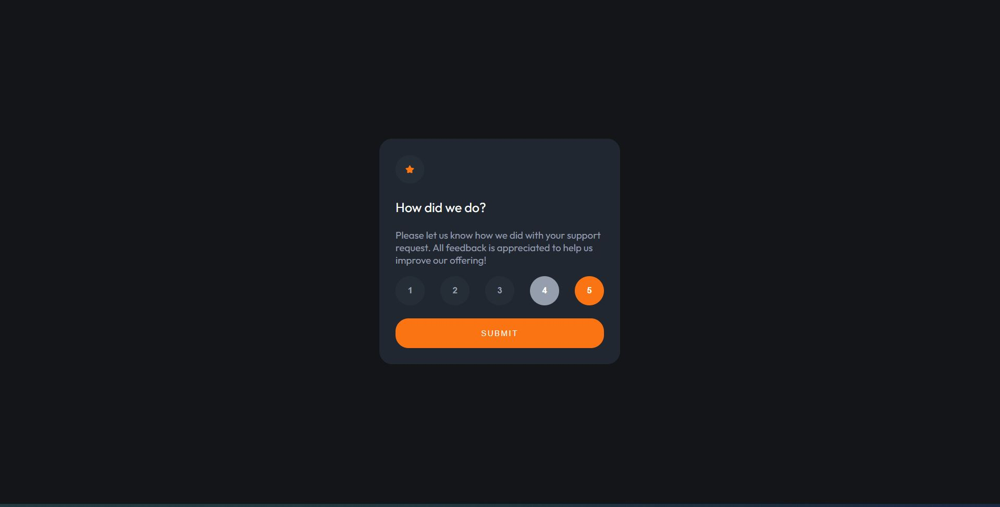

# Frontend Mentor - Interactive rating component solution

This is a solution to the [Interactive rating component challenge on Frontend Mentor](https://www.frontendmentor.io/challenges/interactive-rating-component-koxpeBUmI). Frontend Mentor challenges help you improve your coding skills by building realistic projects. 

## Table of contents

- [Overview](#overview)
  - [The challenge](#the-challenge)
  - [Screenshot](#screenshot)
  - [Links](#links)
- [My process](#my-process)
  - [Built with](#built-with)
  - [What I learned](#what-i-learned)
  - [Continued development](#continued-development)
  - [Useful resources](#useful-resources)
- [Author](#author)

## Overview

### The challenge

Users should be able to:

- View the optimal layout for the app depending on their device's screen size
- See hover states for all interactive elements on the page
- Select and submit a number rating
- See the "Thank you" card state after submitting a rating

### Screenshot



### Links

- Solution URL: [Interactive Rating](https://fm02-interactive-rating.vercel.app/)

## My process

### Built with

- React
- CSS custom properties
- Flexbox
- [React](https://reactjs.org/) - JS library

### What I learned

I learned how to use css modules in React. CSS Modules let you use the same CSS class name in different files without worrying about naming clashes.
I used enviroment variable for min and max rating number, I create and file .env with two variables 

```js
REACT_APP_NOT_MIN_RATING = 1
REACT_APP_NOT_MAX_RATING = 5
```

and in components I used this command:


```js
  const min = process.env.REACT_APP_NOT_MIN_RATING;
  const max = process.env.REACT_APP_NOT_MAX_RATING;
```


### Continued development

In future projects I want to use more React (props, context, hooks)

### Useful resources

- [Adding a CSS Modules Stylesheet](https://create-react-app.dev/docs/adding-a-css-modules-stylesheet/) - This helped me to understand how to use css modules

## Author

- Frontend Mentor - [@dunaidan](https://www.frontendmentor.io/profile/dunaidan)